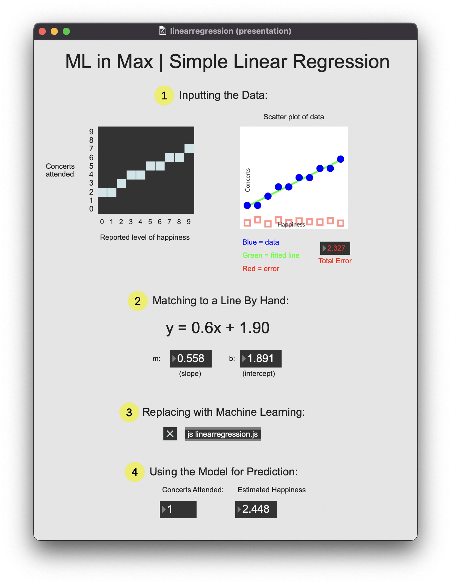
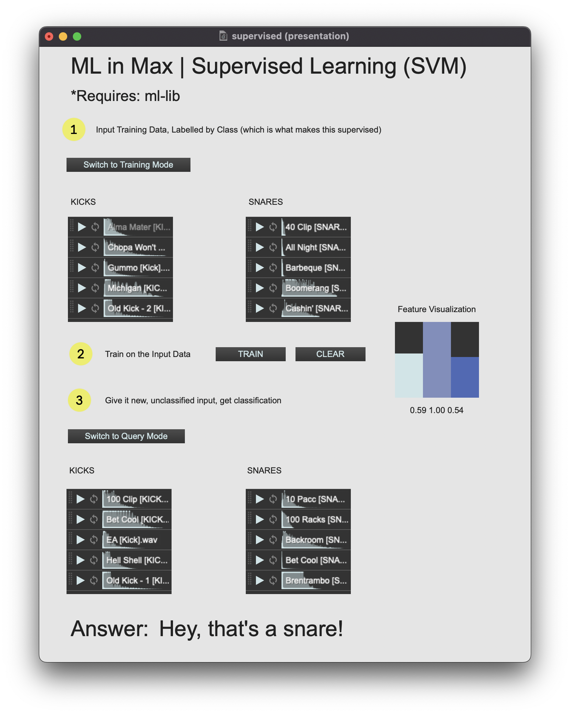
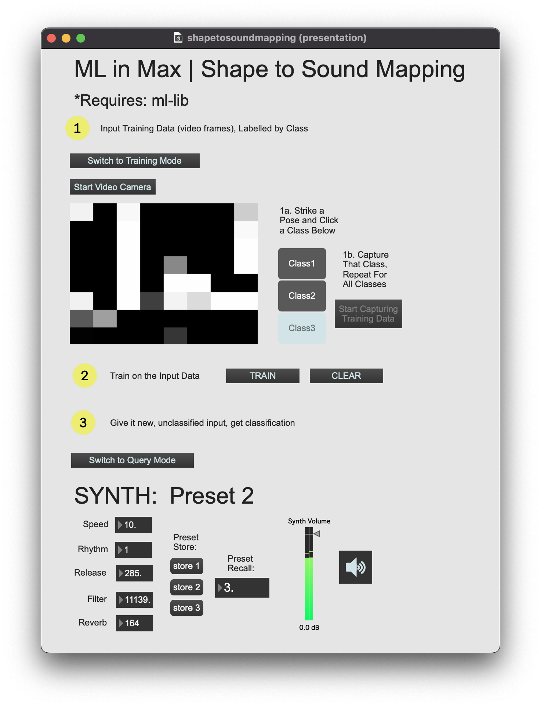
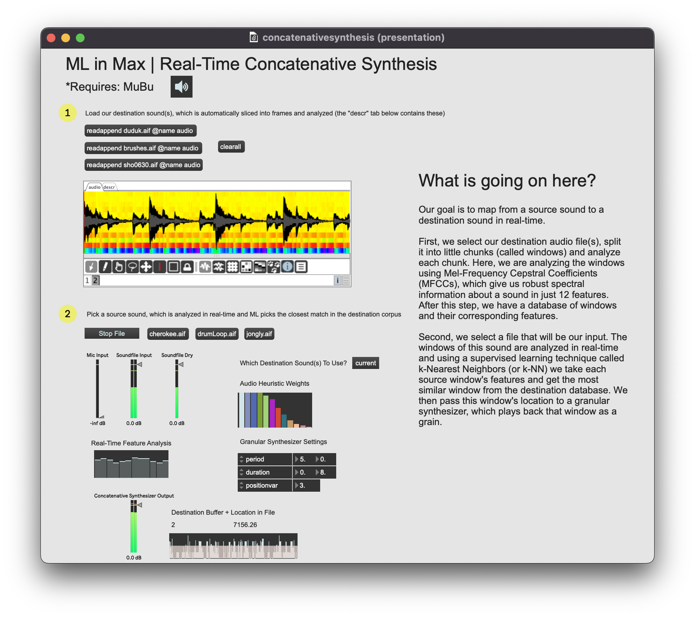
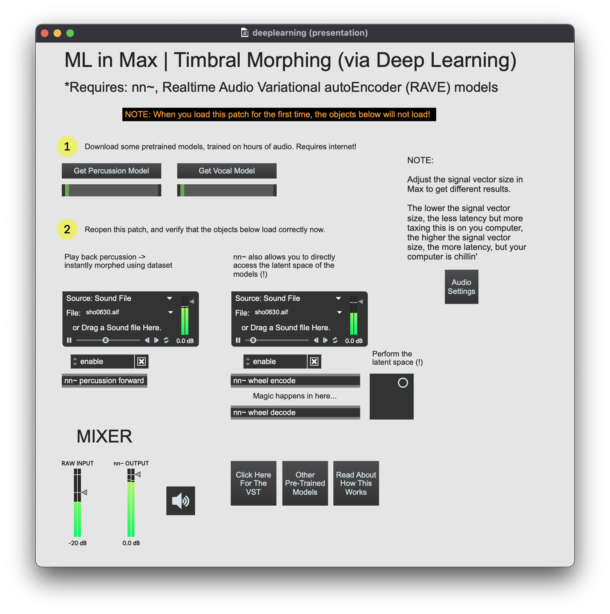

# Machine Learning in Cycling '74's Max
### [Link to Presentation Slides](https://docs.google.com/presentation/d/1I2Lr4kJX5gEyAw2AXSiu_aIr-7siIj-yT0ZrLjSVMjc/edit?usp=sharing)
## Repository for Max patches that accompany my Seattle Max Meetup presentation, March 25th, 2023

 

## Summary
In the accompanying talk and demonstration I introduce what Machine Learning (ML) is using simple linear regression as a first example, then expand into other examples of unsupervised and supervised learning. Next I show how ML may be applied to musical tasks using Max, specifically using externals for Max to accomplish the tasks of 1) mapping between a gesture and synthesizer presets in real-time, 2) mapping between an input sound and a corpus of audio in real-time using concatenative synthesis, and 3) using neural networks trained on corpuses of audio to morph the timbre of a sound at the sample level in real-time.

 

## Assumptions
- You're interested in incorporating ML into your art-making practice
- You're not deeply knowledgeable about ML (yet!)
- You're comfortable programming in Max
- You're aware of how to install packages (File -> Show Package Manager)

 

### ML in Max Resources (Externals Packages)

| Package | Developer | Features | Source | Release Date | Development Status | Install Notes | 
| ------- | --------- | -------- | ------ | ------------ | ------------------ | ------------- |
| [MuBu + PiPo](https://ismm.ircam.fr/mubu/) | ISMM Team @ IRCAM | many different ML algorithms, focused on audio feature extraction and sound organization, somewhat steep learning curve | Closed Source | 2010 | In Development | via Max Package Manager |
| [nn~](https://github.com/acids-ircam/nn_tilde/releases) | Acids Team @ IRCAM | deep learning neural network model in Max | [Open Source](https://github.com/acids-ircam/nn_tilde) | 2022 | In Development | via [this link](https://github.com/acids-ircam/nn_tilde/releases) if on Mac, build from source on Windows, works with [RAVE](https://github.com/acids-ircam/RAVE) trained models |
| [FluCoMa](https://www.flucoma.org/download/) | FluCoMa Team | many different ML algorithms, well organized, some example patches assume knowledge of ML | Closed Source | 2018 | Just Stopped Development | via Max Package Manager |
| [ml.star](https://www.benjamindaysmith.com/ml-machine-learning-toolkit-in-max) | Benjamin D. Smith | a number of different ML algorithms, with nice example patches, although some dated, a good entry point | Closed Source | 2011 | Not in Development | via Max Package Manager |
| [ml-lib](https://github.com/irllabs/ml-lib) | IRL Labs | a direct implenentation of the Gesture Recognition Toolkit by Nick Gillian in Max, very barebones, data type agnostic, data as lists | [Open Source](https://github.com/irllabs/ml-lib) | 2013 | In Development | via Max Package Manager |

 

## Included Patches
### Learning Patches
- **linearregression.maxpat** - demonstrates simple linear regression

- **supervised.maxpat** - demonstrates supervised learning using the support-vector machine algorithm, requires ml-lib externals

- **unsupervised.maxpat** - demonstrates unsupervised learning using the Fuzzy C-means clustering algorithm, requires ml.* externals

### ML in Max Patches
- **shapetosoundmapping.maxpat** - using ML (supervised learning) to learn mappings between a shape and a parametric space, requires ml-lib externals

- **concantenativesynthesis.maxpat** - using ML (unsupervised learning) to map between one corpus of audio and another at the grain level, requires MUBU externals

- **deeplearning.maxpat** - using Deep ML (neural network) to map between an input sound and a trained sound model in real-time, requires nn~ external

 

### RNBO Extras
RNBO is a new Max feature that allows you to write RNBO patches (similar to Max patches) that can then be exported to five different targets, three of which I'll demo.:
- C++ Source
- JS Web Export - see [this Template](https://github.com/Cycling74/rnbo.example.webpage) for a great starting point.
- Raspberry Pi - [see here](https://rnbo.cycling74.com/learn/raspberry-pi-target-overview) for a step-by-step guide
- Audio Plug-in - [click here](https://rnbo.cycling74.com/learn/using-the-vst-audiounit-target) for a step-by-step guide
- Max External

Remember: RNBO is *NOT* Max. Most notably, you can't have symbols (e.g. (parameter $1)) and you also can't incorporate Max externals (as of this writing).
